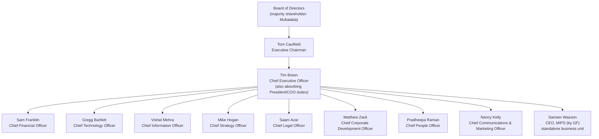
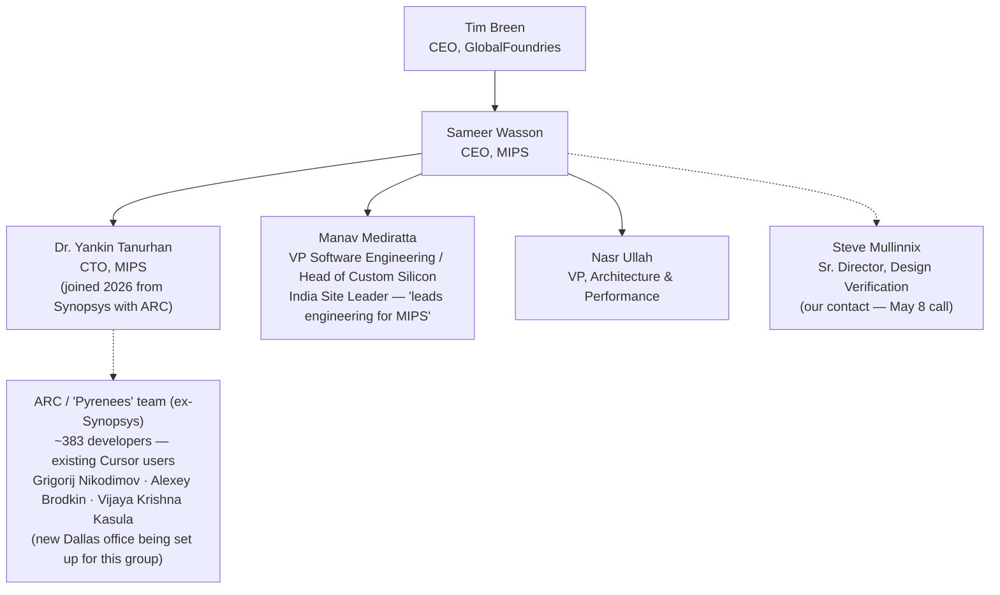
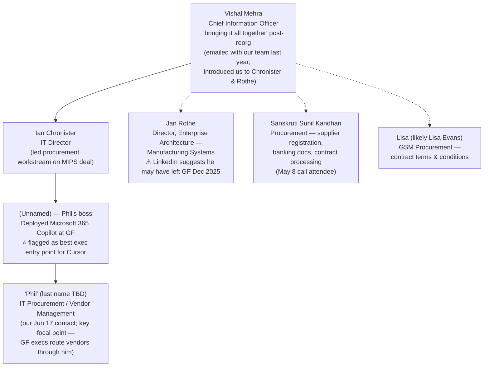

# GlobalFoundries (GF) — Org Chart

> **Account:** GlobalFoundries Inc. (Nasdaq: GFS) — HQ: Malta, NY
> **Last updated:** July 3, 2026
> **Sources:** Granola meeting notes ("Cursor + GF" May 8, 2026; "GlobalFoundries <> Cursor intro" Jun 17, 2026), gf.com leadership page, SEC filings, MIPS leadership page, press releases, LinkedIn. Confidence levels are flagged per person below.

---

## Context that shapes this chart

- **GF is mid-reorganization.** Per our Jun 17 contact: "it might not seem like one GF right now, but it will be." Vishal (Mehra, CIO) was described as the one "bringing it all together."
- **MIPS operates as a standalone business within GF** (acquired Aug 14, 2025). GF then acquired Synopsys' ARC Processor IP business (internally "Pyrenees", closed Jun 2, 2026) and merged it **into MIPS** — this is the ~383-developer group with the existing Cursor contract that came over from Synopsys. A new Dallas office is being set up to support this group.
- **President/COO role is vacant.** Niels Anderskouv resigned effective Mar 2, 2026; his duties were absorbed by CEO Tim Breen and the executive team.
- **AI tooling today:** GitHub Copilot + Microsoft 365 Copilot / Copilot Studio, deployed broadly. AI only became a major focus at GF at the beginning of 2026. Open question (flagged on the Jun 17 call): whether AI coding initiatives are owned by the CTO or CIO org.

---

## Corporate executive team (public info — high confidence)

Notes:

- Greg Pedersen (Chief Accounting Officer) reports into finance under Sam Franklin.
- Site GMs include Hui Peng Koh (SVP & GM, GF Malta) and Ken McAvey (SVP & GM, GF Burlington) — relevant if fab-side engineering conversations open up.

---

## MIPS, by GF — where our current footprint lives

MIPS is the processor & IP business unit. The former Synopsys ARC/"Pyrenees" team (~383 developers, our existing Cursor users under the usage-based contract) merged into MIPS at the Jun 2, 2026 close.

Confidence: Wasson/Tanurhan/Mediratta/Ullah are public (MIPS leadership page). Mullinnix's exact reporting line is unconfirmed (dotted). The ARC team most plausibly lands under Tanurhan, who ran this exact portfolio at Synopsys, but that reporting line is inferred (dotted).

---

## CIO / IT org — the buying center for AI tooling

Assembled from the Jun 17 intro call. This is where vendor management, procurement, and (at least partly) AI tooling decisions sit today.

Confidence: Phil described Ian Chronister and Jan Rothe as his "boss's boss," which places the chain Phil → unnamed boss → Chronister (and/or Rothe). Solid line Phil→boss→Chronister is per his own account; everything else in this diagram is inferred placement within the CIO org (dotted). Rothe's current employment at GF is uncertain.

---

## Engineering / product development (partial — expansion targets)

| Name | Title | Org | Why they matter | Confidence |
|---|---|---|---|---|
| Gregg Bartlett | Chief Technology Officer | CTO org | Possible owner of AI coding initiatives (CTO-vs-CIO ownership is an open question) | High (public) |
| Isabelle Ferain | VP, Product Development Engineering (Malta) — leads ~300 engineers across US/EMEA/APAC | Engineering | EPD leader Sam has already reached out to | High (public + our outreach) |
| Manav Mediratta | VP Software Engineering, MIPS | MIPS | Leads engineering for MIPS; natural champion for expanding Cursor beyond the ARC group | High (public) |

---

## Full contact roster

| Name | Title / Role | Relationship status | Source |
|---|---|---|---|
| Tim Breen | CEO | None | Public |
| Vishal Mehra | CIO | Emailed with our team last year; introduced us to Chronister & Rothe | Jun 17 call + public |
| Ian Chronister | IT Director ("boss's boss" of Phil) | Intro'd via Vishal; possible AI coding decision-maker | Jun 17 call + LinkedIn |
| Jan Rothe | Director, Enterprise Architecture — Mfg Systems | Intro'd via Vishal; ⚠ may have left GF Dec 2025 | Jun 17 call + LinkedIn |
| "Phil" (last name TBD) | IT Procurement / Vendor Management | **Active contact** — met Jun 17; will raise Cursor with his boss (the M365 Copilot owner) when back from travel | Jun 17 call |
| Phil's boss (unnamed) | Deployed 365 Copilot; best exec starting point | Not yet met — warm path via Phil | Jun 17 call |
| Sanskruti Sunil Kandhari | Procurement (supplier registration, contracts) | **Active contact** — May 8 call; drove supplier onboarding | May 8 call |
| Lisa (likely Lisa Evans) | GSM Procurement — contract T&Cs | Working contact on contract terms | Jun 17 call + LinkedIn |
| Steve Mullinnix | Sr. Director, Design Verification, MIPS | Met May 8; confirmed GF's Copilot footprint; MIPS not on Cursor yet | May 8 call + public |
| Sameer Wasson | CEO, MIPS | None | Public |
| Manav Mediratta | VP SW Engineering, MIPS | Outreach started (Sam) | Jun 17 call + public |
| Isabelle Ferain | VP, Product Development Engineering | Outreach started (Sam) | Jun 17 call + public |
| Grigorij Nikodimov | ARC/Pyrenees (ex-Synopsys) | **Existing Cursor users** — May 8 call | May 8 call |
| Alexey Brodkin | ARC/Pyrenees (ex-Synopsys) | **Existing Cursor users** — May 8 call | May 8 call |
| Vijaya Krishna Kasula | ARC/Pyrenees (ex-Synopsys) | **Existing Cursor users** — May 8 call | May 8 call |

---

## Known gaps / next steps to fill in the chart

1. **Phil's full name and his boss's name** — the single most important gap; the boss owns M365 Copilot deployment and is the recommended exec entry point.
2. **CTO vs. CIO ownership of AI coding** — determines whether Gregg Bartlett's or Vishal Mehra's org is the decision-maker.
3. **Confirm Jan Rothe's status** — LinkedIn suggests departure from GF in Dec 2025 despite being name-dropped on the Jun 17 call.
4. **Where the ARC/Pyrenees ~383 devs formally report** inside MIPS (likely under CTO Yankin Tanurhan, who ran the same portfolio at Synopsys).
5. **Engineering leaders below the VP level** in Bartlett's CTO org and at the fab sites (Malta, Dresden, Singapore, Burlington) — untouched territory.
